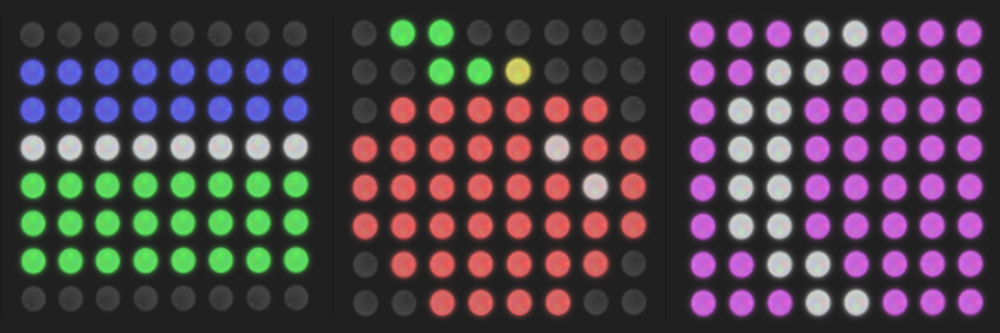

# ApplePi
> We are young people from Poland who take part in the Astro Pi Mission Space Lab 2018-2019

## General info
The main purpose of our experiment is to detect the shoreline in order to show the effects of global warming. We used the OpenCV library for this purpose and with the use of it we analyzed the pictures of Earth's surface. 

In our eyes, global warming should be of the utmost importance. Finding ways to increase awareness of this progressing threat is not only important, but also interesting to us. 
For this reason, showing the rising ocean level in satellite images seemed like a great way to illustrate the scale of the problem. 

Our program photographed the surface of the Earth every 31 seconds. Each photo was analyzed by a program that outlined the shoreline, created color land-water-cloud maps, showing the content of these surface components below the station and then saved in three versions: original, with the outlined coastline and with marked colors. Then, it saved the coordinates and the time each photo was taken in the data01.csv file to help identify it on the Earth.

In addition, the program displayed on the LED matrix the percentage of each of the three aforementioned components of the image. It also showed the Moon whenever the night, which significantly hindered the analysis, was detected. Before each photo was taken, the logo of our team was also displayed. Examples of these displays are shown below.

## Technologies
* Python
* OpenCV
* Astro Pi Kit 
